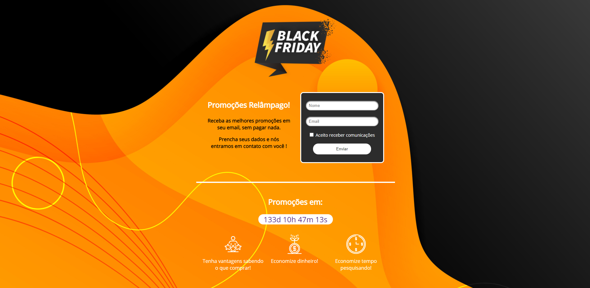

<h1 align="center"> BlackFriday Relâmpago</h1>

Projeto desenvolvido durante o Hiring coders da VTEX com Gama Academy

Preview: https://blackfridayrelampago.netlify.app/

📖 - Projeto para o Desafio 1 do #hiringcoders, com o intúito de desenvolver uma Landing Page responsiva estilo blackfriday que
retorne dados inseridos no localstorage

<h2>🚀 Tecnologias utilizadas: </h2>

- HTML
- CSS
- JavaScript

<h2>Para iniciar o projeto use: </h2>
git clone https://github.com/olucasklein/gama-blackfriday-relampago.git

<h2>Para iniciar a Landing Page, recomendo a utilização do Live Server no VSCode</h2>

<h2>📝 Licença</h2>
Esse projeto está sob a licença MIT. Veja o arquivo LICENSE para mais detalhes.
